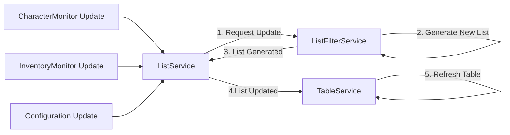
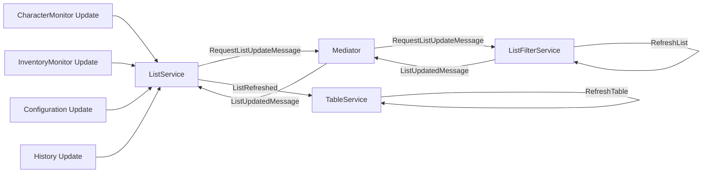

List generation flow

```mermaid
flowchart LR
   A[CharacterMonitor Update]
   B[InventoryMonitor Update]
   C[Configuration Update]
   D[ListService]
   E[ListFilterService]
   F[TableService]
   A --> D
   B --> D
   C --> D
   D --> |1. Request Update|E
   E --> |2. Generate New List|E
   E --> |3. List Generated|D
   D --> |4.List Updated|F
   F --> |5. Refresh Table|F
   
```

Expanded list generation flow

```mermaid
flowchart LR
   A[CharacterMonitor Update]
   B[InventoryMonitor Update]
   C[Configuration Update]
   D[History Update]
   E[ListService]
   F[Mediator]
   G[ListFilterService]
   H[TableService]
   A --> E
   B --> E
   C --> E
   D --> E
   E --> |RequestListUpdateMessage|F
   F --> |RequestListUpdateMessage|G
   G --> |RefreshList|G
   G --> |ListUpdatedMessage|F
   F --> |ListUpdatedMessage|E
   E --> |ListRefreshed|H
   H --> |RefreshTable|H
   
   
   
   
```